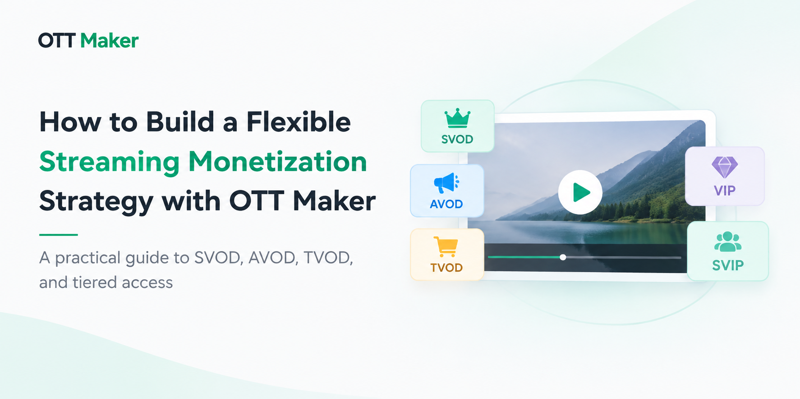
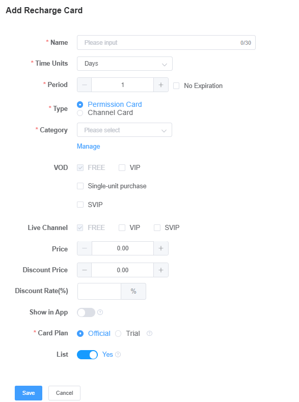

# Flexible Monetization Architecture for OTT Platforms: Supporting Different Content and User Scenarios

## Overview

Modern OTT platforms are no longer built around a single revenue model.

As streaming businesses expand into different scenarios such as entertainment, sports, short drama, and IPTV services, they need more flexible ways to connect content value with user expectations.

A successful streaming platform must answer several questions:

- How can different types of content be monetized effectively?
- How can platforms provide different access options for different users?
- How can businesses combine subscription, advertising, and transactional models in one system?

A flexible OTT monetization architecture helps businesses create suitable revenue strategies based on content types, audience behavior, and business goals.

---

# Why Flexible Monetization Matters for OTT Platforms

Traditional streaming platforms often rely on a single monetization method.

For example:

- Subscription-based services focus on recurring membership.
- Advertising-supported platforms rely on free access and audience growth.
- Transaction-based services charge users for specific content.

Each model has its own advantages, but no single approach can satisfy every business scenario.

Different audiences have different needs:

- A sports viewer may only need access to a specific event.
- A short drama viewer may prefer a short-term viewing package.
- An IPTV user may expect monthly or yearly channel subscriptions.
- Premium content users may want exclusive access.

Therefore, modern OTT platforms need the ability to combine multiple monetization approaches.

---

# Three Core Monetization Models

A flexible OTT platform usually supports three major monetization models.

## 1. Subscription Video on Demand (SVOD)

SVOD allows users to access content through recurring subscription plans.

Common examples include:

- Monthly memberships
- Quarterly plans
- Annual subscriptions

SVOD is suitable for:

- Large content libraries
- Long-term users
- IPTV subscription services

The key value of SVOD is creating continuous user relationships and predictable revenue.

---

## 2. Advertising-Based Video on Demand (AVOD)

AVOD allows users to access selected content for free while businesses generate revenue through advertising.

AVOD can support:

- User acquisition
- Free content discovery
- Audience growth

For many streaming businesses, advertising is not only a revenue source but also an entry point for converting free users into paying customers.

---

## 3. Transactional Video on Demand (TVOD)

TVOD allows users to pay for specific content instead of purchasing a full subscription.

Common scenarios include:

- Premium movies
- Special programs
- Sports events
- Exclusive content

TVOD gives businesses more flexibility when certain content has independent commercial value.

---

# Access Management: Creating Different User Experiences

Monetization models determine how businesses generate revenue.

Access management determines what users can watch.

A flexible OTT platform can create different access levels, such as:

## Free Access

Suitable for:

- Content discovery
- Advertising-supported viewing
- User acquisition

## VIP Access

Suitable for:

- Premium content libraries
- Standard membership benefits

## SVIP Access

Suitable for:

- Exclusive programs
- Higher-value content
- Advanced membership experiences

By combining monetization models with access levels, businesses can create different user journeys instead of offering the same package to everyone.

---

# Flexible Package Configuration

A scalable OTT platform requires flexible package management.

Businesses may need to configure different plans based on:

- Content types
- Access permissions
- Pricing strategies
- Subscription duration

Examples:

## Short Drama Platform

- Free episodes for discovery
- Short-term viewing packages
- VIP membership access

## Sports Platform

- Event passes
- Tournament packages
- Long-term memberships

## IPTV Platform

- Basic channel packages
- Premium channel plans
- Annual subscriptions

The goal is not creating more packages.

The goal is creating the right package for the right audience.

## Example: OTT Maker Recharge Card Configuration

OTT Maker allows businesses to configure flexible access packages based on different content and user requirements.

Key configuration options include:

- Package duration
- Access type
- Content permissions
- VIP/SVIP access levels
- Pricing settings

---

# How OTT Maker Supports Flexible Monetization

OTT Maker provides an OTT platform foundation that helps businesses manage:

- Content operations
- User access
- Monetization strategies
- Multi-device distribution

Key capabilities include:

- Content management
- Live streaming and VOD operations
- Flexible access plans
- VIP and SVIP permission management
- Advertising configuration
- Web, mobile, and TV distribution

By connecting these capabilities in one platform, businesses can adjust their monetization strategies according to changing content types, user expectations, and market requirements.

---

# Conclusion

The future of OTT monetization is not about choosing one single revenue model.

Subscription, advertising, and transactional models each serve different business purposes.

A flexible OTT platform allows businesses to combine these approaches, manage different access levels, and create better experiences for both operators and viewers.

Modern streaming success depends not only on delivering video content, but also on building a scalable business system around it.
