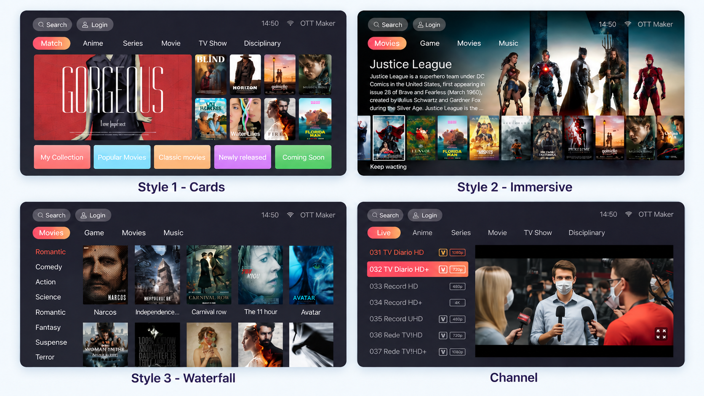
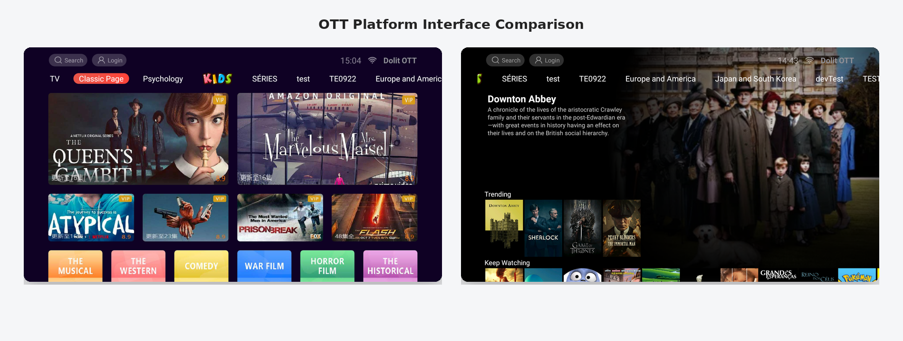
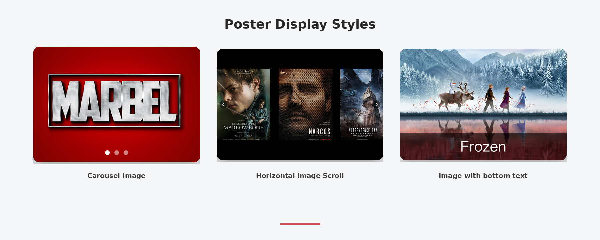

# Designing Flexible OTT Interfaces for Content Discovery

An OTT platform can have a large content library and still provide a difficult viewing experience. When important titles are buried, categories are difficult to navigate, or interface elements do not lead to clear next actions, viewers spend more time searching and less time watching.

For streaming businesses, content discovery is not only a recommendation problem. It is also an interface management problem. Operators need to organize content, prioritize different business objectives, and adapt the viewing experience to different devices and usage scenarios.

This article presents a practical framework for designing flexible OTT interfaces and explains how OTT Maker maps this framework to configurable pages, content sections, presentation formats, and destination actions.

---

## Why Interface Management Affects Content Discovery

An OTT homepage is more than a visual entry point. It determines how viewers encounter content, browse categories, and move from discovery to playback.

The structure of a homepage can influence:

- Which titles receive the most visibility;
- How quickly viewers find relevant content;
- Whether viewers continue exploring other categories;
- How effectively new releases and live events are presented;
- How many steps viewers need to take before reaching playback.

A fixed layout may be sufficient for a small content library. As a platform grows, however, different content types and audience groups create different interface requirements.

For example:

- A movie service may need a prominent area for new releases.
- An IPTV operator may need direct access to live channels and regional categories.
- A short-drama service may need frequently updated promotional sections.
- A subscription-based service may need a clear path from premium content to access or subscription pages.

The objective is not to create an unrelated interface for every scenario. It is to maintain a consistent platform identity while allowing the page structure to change according to content strategies and user goals.

---

# A Practical Model for Flexible OTT Interfaces

A flexible interface can be planned as a sequence:

**User goal → Page structure → Content sections → Presentation format → Destination action**

Each layer answers a different operational question.

| Layer | Key question | Example |
| --- | --- | --- |
| User goal | What should the viewer do next? | Watch a live match or find a new movie |
| Page structure | Where should the journey begin? | Home page, category page, or premium page |
| Content sections | Which content should be grouped together? | New releases, sports, or regional content |
| Presentation format | How should the content be displayed? | Banner, poster row, text section, or video window |
| Destination action | Where should the selected element lead? | Live channel, VOD detail page, collection, or subscription page |

This model connects interface decisions with viewing objectives. It also prevents interface management from becoming a list of unrelated visual features.

---

## 1. Define the Viewing Goal

Before creating a page, operators should define the action the page is intended to support.

A page should not exist only because the platform has another group of content to display. It should help viewers complete a specific task.

Common viewing goals include:

- Discovering a new movie or series;
- Entering a live channel quickly;
- Browsing a short-drama collection;
- Accessing premium content;
- Continuing a previously started program;
- Finding content by genre, language, region, or topic.

Once the goal is defined, the page can be organized around the corresponding viewing journey.

For example:

- A category page can support structured browsing.
- A live page can reduce the distance between the viewer and a channel.
- A premium page can group subscription-based content and related access paths.
- A collection page can organize titles around a theme, campaign, or event.

In OTT Maker, operators can create separate pages and content areas for different viewing journeys. This allows the interface to be organized around user goals rather than forcing every content type into one fixed homepage structure.

---

## 2. Adapt the Interface to Different Devices

OTT services are commonly accessed through televisions, mobile phones, tablets, and other connected devices.

These environments do not provide the same screen size or interaction model.

A TV interface is viewed from a distance and is often navigated with a remote control. It requires clear spacing, visible categories, and predictable focus movement.

A mobile interface is viewed on a smaller screen and is usually navigated through touch and vertical scrolling.

Using one unchanged layout across both environments can create usability problems.

The content strategy may remain consistent, but the layout and interaction pattern should reflect the target device.

OTT Maker provides separate TV and mobile interface templates. Operators can select the relevant template and configure the page arrangement for the target environment.

---

## 3. Select a Page Structure for the Business Scenario

Page structure affects how viewers scan, compare, and enter content.

When selecting a page structure, operators should consider:

- How viewers usually discover content;
- Which content requires the highest visibility;
- Whether the page is intended for discovery, promotion, or quick access;
- Whether the page needs to support broad browsing or a focused campaign;
- How the structure will work on the target device.

OTT Maker provides page-type options, including card-based and immersive layouts.

A card-based structure may be suitable for browsing a larger catalog.

An immersive structure may be more appropriate when one title, live event, or campaign needs to receive primary attention.

The page type does not determine the entire user experience, but it establishes the framework in which content sections and interface elements are organized.

---

## 4. Organize Content Areas That Can Change

After defining the page structure, operators need to decide which content areas should appear and how they should be prioritized.

A page may contain sections for:

- Featured content;
- New releases;
- Live channels;
- Genres or regional categories;
- Collections and campaigns;
- Premium content;
- Recently added or recently watched programs.

These sections should not be treated as permanent blocks with no operational purpose.

Their position and visibility may need to change as the content schedule or business focus changes.

For example:

- A new movie may need a featured section during its release period.
- A live sports event may need a high-priority position on match days.
- A seasonal collection may be relevant only during a specific campaign.
- A newly added content section may need frequent updates.

OTT Maker's interface editor allows operators to create, reorder, and remove content sections.

Sections can use different content sources, including:

- Manually selected content;
- Content categories;
- Tags;
- Newly added items.

---

## 5. Match Presentation Formats With Content Types

Content is not automatically easier to discover simply because it has been added to a page.

The presentation format also affects how viewers understand the content and decide what to open.

Different content types may require different presentation formats:

- A major release may need a large visual area.
- A collection of related titles may be easier to browse through poster-based sections.
- A live event may require a direct and highly visible entry point.
- An editorial explanation may be better presented through a text section.

OTT Maker supports multiple interface components and presentation formats, including:

- Image or GIF areas;
- Images with text;
- Carousel images;
- Square images;
- Text sections;
- Video windows;
- Horizontal scrolling sections.

The purpose of these options is not simply to provide visual variety.

They allow operators to match the form of presentation with the content type and intended viewing action.

---

## 6. Connect Interface Elements With the Next Action

Content discovery is incomplete if viewers can see a poster or banner but still need to navigate through several unrelated screens to reach the content.

Interface elements should therefore be connected to meaningful destinations.

Depending on the business scenario, an element may lead to:

- A live channel;
- A VOD detail page;
- A content category;
- A collection or curated page;
- A subscription-related page.

For example:

- A sports banner can open a live channel.
- A movie poster can open a VOD detail page.
- A category element can open a genre or regional content page.
- A premium content element can lead to a subscription-related destination.

In OTT Maker, operators can configure destinations for interface elements within the interface management workflow.

This connects the visual layer of the page with the content and access paths behind it.

---

# How OTT Maker Maps Interface Decisions to Configuration

| Interface decision | OTT Maker capability | Operational purpose |
| --- | --- | --- |
| Define a viewing journey | Create separate pages and content areas | Organize the platform around different user goals |
| Support different devices | TV and mobile templates | Adapt layouts and interaction patterns |
| Select a page structure | Card-based and immersive layouts | Match the structure to discovery, promotion, or quick access |
| Organize content | Add, reorder, and remove sections | Adjust page priority as content and campaigns change |
| Select content sources | Manual content, categories, tags, or newly added items | Populate sections according to content rules |
| Choose a presentation format | Image, carousel, text, video, and horizontal-scroll components | Present each content type in a suitable form |
| Guide the next action | Link elements to live, VOD, category, collection, or subscription destinations | Reduce navigation steps between discovery and viewing |

---

# Example Interface Strategies

## New Movie Release

An operator can create a prominent launch area for a new title, place related movies in a supporting section, and connect the main visual element to the VOD detail page.

When the release campaign ends, the section can be reordered or replaced without redesigning the entire platform.

## IPTV Live-Channel Access

An IPTV operator can place live channels and regional categories near the top of a page, use a format that is easy to scan on a TV screen, and connect banners or channel cards directly to playback destinations.

## Short-Drama Collection

For short-form content, an operator can create a dedicated page, group episodes or series into focused collections, and use frequently updated sections for new releases.

## Premium Content and Subscription Access

An operator can create a page or section for premium content and connect selected elements to subscription-related destinations.

This keeps premium discovery and access guidance within the same interface structure.

---

# An Operational Checklist

Before publishing a new page or revising an existing one, operators can review:

- What is the primary action this page should support?
- Which content requires the highest visibility for this audience or campaign?
- Is the page structure appropriate for the target device?
- Are sections ordered according to the current content strategy?
- Does each section use a presentation format that fits its content?
- Can viewers reach the intended destination through one clear action?

These questions turn interface management into a repeatable operating process rather than a one-time design task.

---

# Conclusion

Effective OTT content discovery depends on more than the size of a content library.

It depends on whether the platform can organize content around user goals, adapt the interface to different viewing environments, present each content type appropriately, and connect discovery with a clear next action.

OTT Maker provides configuration options for this process, including separate pages, editable content sections, page-type choices, multiple presentation components, TV and mobile templates, and links to live, VOD, category, collection, and subscription destinations.

The central principle is simple:

**Interface structure should reflect content strategy and viewing behavior.**
